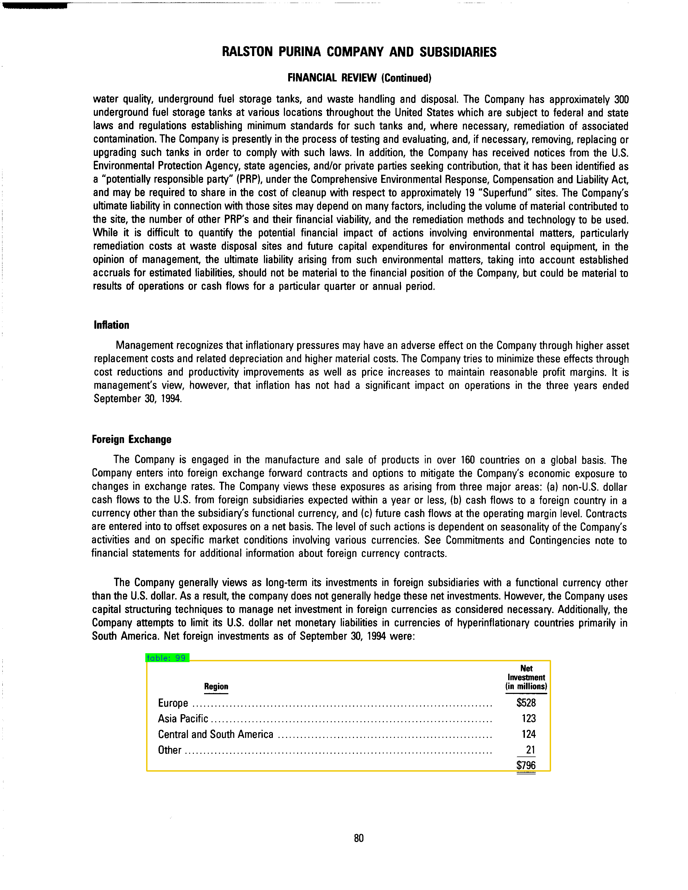
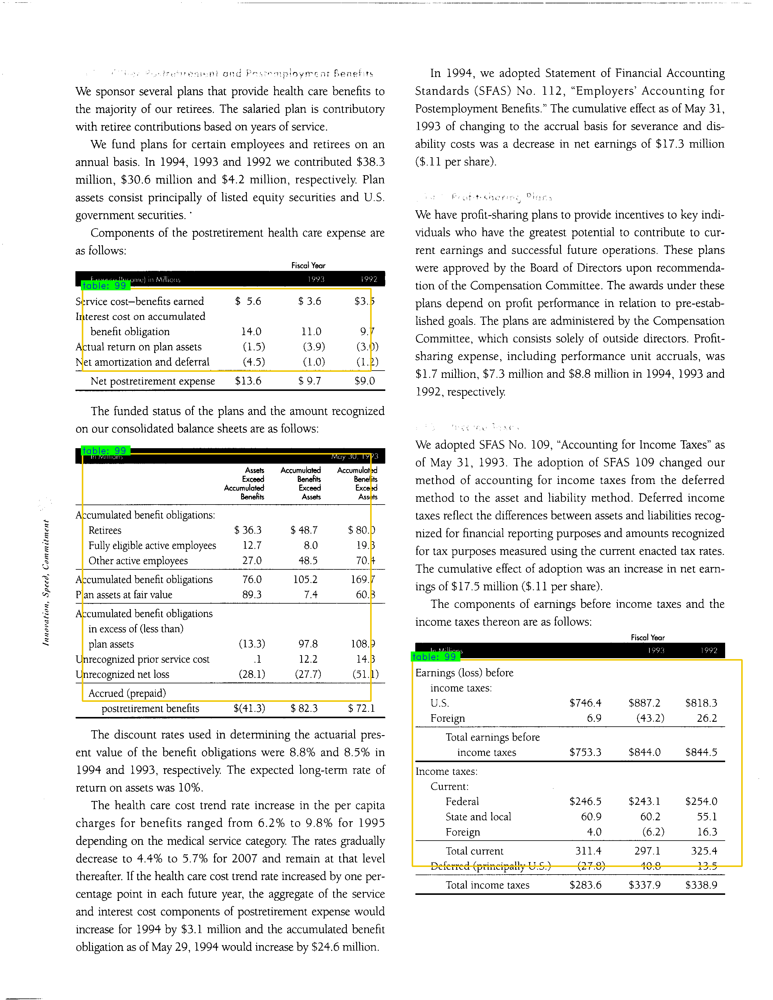
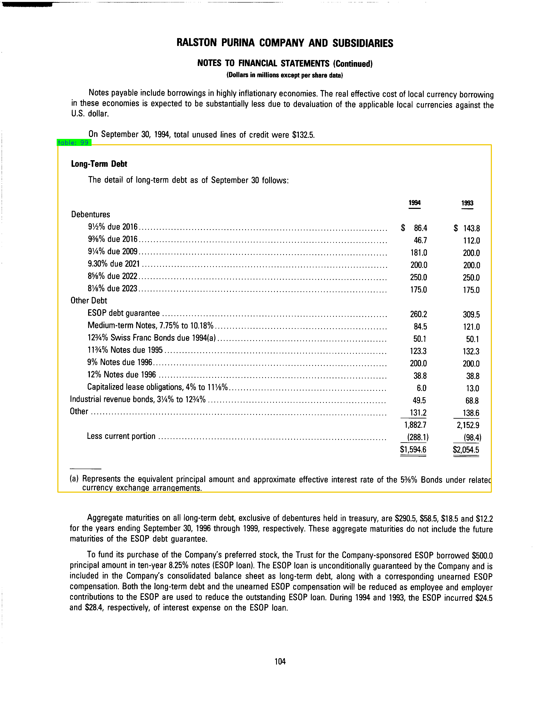
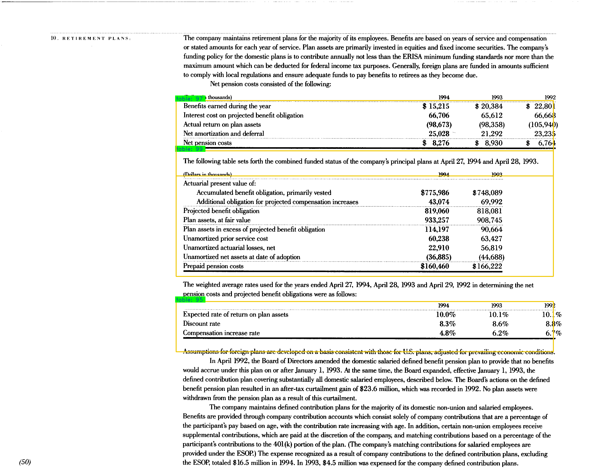

# Faster R-CNN for Open Images Dataset by Keras

This was the setup I used for my Honors Thesis at the University of Massachusetts, *An Analysis of F-RCNN vs YOLO in Table Detection*.

## Introduction 
The keras-version of Faster R-CNN was originally pieced together by [RockyXu66](https://github.com/RockyXu66/Faster_RCNN_for_Open_Images_Dataset_Keras). 

## Installation

This project can either be ran on the cloud using *Google Colab* or locally using *Anaconda*.

### Cloud

**`Google Colab`** comes bundled with [**`Jupyter Notebook Support`**](https://colab.research.google.com/) & most Python distributions by default. To run on Google Colab, upload this directory to your Google Drive. The only change needed is the chdir command. This project has been setup to install the appropiate libraries, so no other changes are needed.

### Locally

 To run this locally, I would recommend using an **`Anaconda`** environment. Officially supported downloads/distributions can be found at: [https://www.anaconda.com/](https://www.anaconda.com/) The following distributions are required in your conda environment: *Python, Tensorflow, Keras, h5py*.

### Version Check
- Tensorflow v.1.15
- Keras v.2.3.1
- h5py v.2.10.0
- Python 3.7

## Project Structure

The ``data`` folder contains all the images that will be used during training and validation, as well as their annotated bounding boxes in an `(x1, y1, x2, y2)` format. You can execute the following files in the given order:

- 0_preprocess_data.ipynb
- 1_train_model.ipynb
- 2_test_model.ipynb

## Results

